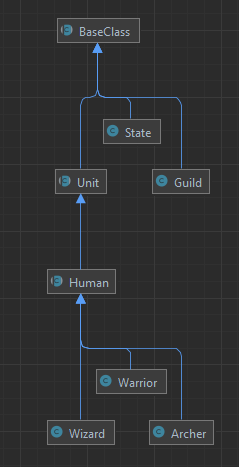

### Д/З


<details>
<summary>Лог выполнения</summary>

```code
Array
(
    [Red] => Array
        (
            [0] => Волшебник 1 (game\Wizard) [100 HP]
            [1] => Воин 1 (game\Warrior) [200 HP]
            [2] => Воин 2 (game\Warrior) [200 HP]
            [3] => Воин 3 (game\Warrior) [200 HP]
        )

    [Blue] => Array
        (
            [0] => Воин 1 (game\Warrior) [200 HP]
            [1] => Лучник 1 (game\Archer) [100 HP]
            [2] => Волшебник 1 (game\Wizard) [100 HP]
            [3] => Волшебник 2 (game\Wizard) [100 HP]
        )

)
Волшебник 1 (game\Wizard) наносит удар Лучник 1 (game\Archer) на 5 
Лучник 1 (game\Archer) остался жив!
Лучник 1 (game\Archer) наносит удар Волшебник 1 (game\Wizard) на 20 
Волшебник 1 (game\Wizard) остался жив!
Волшебник 1 (game\Wizard) наносит удар Лучник 1 (game\Archer) на 5 
Лучник 1 (game\Archer) остался жив!
Лучник 1 (game\Archer) наносит удар Волшебник 1 (game\Wizard) на 20 
Волшебник 1 (game\Wizard) остался жив!
Волшебник 1 (game\Wizard) наносит удар Лучник 1 (game\Archer) на 5 
Лучник 1 (game\Archer) остался жив!
Лучник 1 (game\Archer) наносит удар Волшебник 1 (game\Wizard) на 20 
Волшебник 1 (game\Wizard) остался жив!
Волшебник 1 (game\Wizard) лечит Волшебник 1 (game\Wizard) на 15 
Лучник 1 (game\Archer) наносит удар Волшебник 1 (game\Wizard) на 20 
Волшебник 1 (game\Wizard) остался жив!
Волшебник 1 (game\Wizard) лечит Волшебник 1 (game\Wizard) на 15 
Лучник 1 (game\Archer) наносит удар Волшебник 1 (game\Wizard) на 20 
Волшебник 1 (game\Wizard) остался жив!
Волшебник 1 (game\Wizard) лечит Волшебник 1 (game\Wizard) на 15 
Лучник 1 (game\Archer) наносит удар Волшебник 1 (game\Wizard) на 20 
Волшебник 1 (game\Wizard) остался жив!
Волшебник 1 (game\Wizard) лечит Волшебник 1 (game\Wizard) на 15 
Лучник 1 (game\Archer) наносит удар Волшебник 1 (game\Wizard) на 20 
Волшебник 1 (game\Wizard) остался жив!
Волшебник 1 (game\Wizard) лечит Волшебник 1 (game\Wizard) на 15 
Лучник 1 (game\Archer) наносит удар Волшебник 1 (game\Wizard) на 20 
Волшебник 1 (game\Wizard) остался жив!
Волшебник 1 (game\Wizard) лечит Волшебник 1 (game\Wizard) на 15 
Лучник 1 (game\Archer) наносит удар Волшебник 1 (game\Wizard) на 20 
Волшебник 1 (game\Wizard) остался жив!
Волшебник 1 (game\Wizard) лечит Волшебник 1 (game\Wizard) на 15 
Лучник 1 (game\Archer) наносит удар Волшебник 1 (game\Wizard) на 20 
Волшебник 1 (game\Wizard) остался жив!
Волшебник 1 (game\Wizard) лечит Волшебник 1 (game\Wizard) на 15 
Волшебник 1 погиб! как так?!
Лучник 1 (game\Archer) наносит удар Волшебник 1 (game\Wizard) на 20 
Array
(
    [Red] => Array
        (
            [0] => Волшебник 1 (game\Wizard) [Волшебник 1 погиб! как так?!]
            [1] => Воин 1 (game\Warrior) [200 HP]
            [2] => Воин 2 (game\Warrior) [200 HP]
            [3] => Воин 3 (game\Warrior) [200 HP]
        )

    [Blue] => Array
        (
            [0] => Воин 1 (game\Warrior) [200 HP]
            [1] => Лучник 1 (game\Archer) [85 HP]
            [2] => Волшебник 1 (game\Wizard) [100 HP]
            [3] => Волшебник 2 (game\Wizard) [100 HP]
        )

)
```
</details>

### Задание

1. Придумайте класс, который описывает любую сущность из предметной области библиотеки: книга, шкаф, комната и т.п.
2. Опишите свойства классов из п.1 (состояние).
3. Опишите поведение классов из п.1 (методы).
4. Придумайте наследников классов из п.1. Чем они будут отличаться?
5. Создайте структуру классов ведения книжной номенклатуры.
   - Есть абстрактная книга.
   - Есть цифровая книга, бумажная книга.
   - У каждой книги есть метод получения на руки.
   У цифровой книги надо вернуть ссылку на скачивание, а у физической – адрес библиотеки, где ее можно получить. У всех книг формируется в конечном итоге статистика по кол-ву прочтений.
   Что можно вынести в абстрактный класс, а что надо унаследовать?

Дан код:
```php
class A {
    public function foo() {
        static $x = 0;
        echo ++$x;
    }
}
$a1 = new A(); // Ничего, тк. нет вывода, просто создание
$a2 = new A(); // Ничего, тк. нет вывода, просто создание
$a1->foo(); // 1 = статичное св-во $x = $x(0) + 1 -> 1
$a2->foo(); // 2 = статичное св-во $x = $x(1) + 1 -> 2
$a1->foo(); // 3
$a2->foo(); // 4
```
Что он выведет на каждом шаге? Почему?
Немного изменим п.5
```php
class A {
    public function foo() {
        static $x = 0;
        echo ++$x;
    }
}
class B extends A {
}
$a1 = new A(); // Ничего, тк. нет вывода, просто создание
$b1 = new B(); // Ничего, тк. нет вывода, просто создание
$a1->foo(); // 1 -> A::x = A::x(0) + 1
$b1->foo(); // 1 -> B::x = B::x(0) + 1
$a1->foo(); // 2 -> A::x = A::x(1) + 1
$b1->foo(); // 2 -> B::x = B::x(1) + 1
```
Что он выведет теперь?